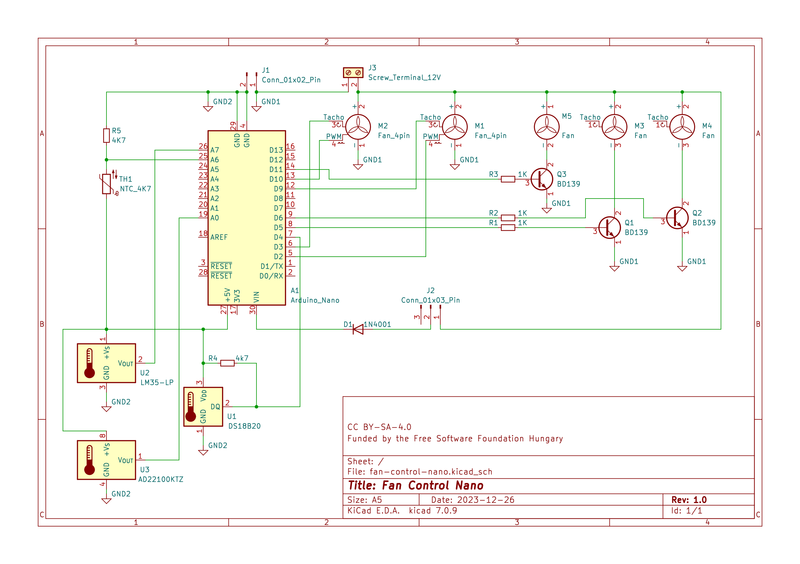
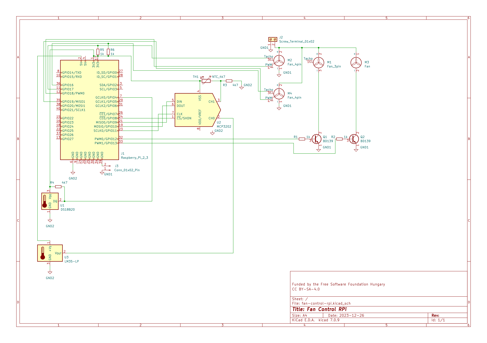

# fan-control

A project for controlling 2, 3, and 4 wire DC fans using an Arduino Nano or a Raspberry Pi. It also integrates into munin monitoring. Funded by the Free Software Foundation Hungary. The code is under GPLv3. Schematics, drawings, and the documentation is under CC BY-SA-4.0. If you have an idea about how to improve the project, just file an issue.

## Pages

* [Bill Of Materials](bom/billofmaterials-nano.md)
* [Datasheet Archive](bom/datasheets.md)
* [KiCad and Fritzing](circuits/)

## Fan Control Nano - Schematic

*Note: There are multiple solutions displayed here, only implement the needed ones.*

## Fan Control Nano - Code

* [Arduino Nano Code](fan-control-nano/fan-control-nano.ino)

### Serial communication

* 115200 bps
* Main Functions:
  * **pwm?**             - GET all PWM outputs
  * **pwm[A-F]?**        - GET PWM output
  * **pwm[A-F]p**        - SET PWM output to pilot mode
  * **pwm[A-F][0-255]**  - SET PWM output manually
  * **rpm[C,D]?**        - GET RPM output from 4-wire fans
  * **t?**               - GET measured temperature
  * **t[A,D,L,N]?**      - GET measured temperature from selected source
  * **ts?**              - GET temperature source (example Dallas 1-wire)
  * **tsa?**             - GET all available temperature sources
* Calibration Functions:
  * **Ch[L,H,C][A-F]?**        - GET LOW HIGH temperature for a channel
  * **Ch[L,H,C][A-F][0-100]**  - SET LOW HIGH temperature for a channel
  * **p[L,H][A-F]?**           - GET LOW HIGH PWM speed for a channel
  * **p[L,H][A-F][0-255]**     - SET LOW HIGH PWM for a channel
* Misc Func:
  * **hrs?**           - get board uptime [%d:%H:%M:%S]
  * **ver?**           - HW board version number
  * **cbn?**           - CODE build version number
  * **?**              - Ping, Are You There?  + Flash a LED

## Fan Control RPi - Schematic

*Note: There are multiple solutions displayed here, only implement the needed ones.*

*Note: Under testing.*

## Planned updates

* External ADC experiments
* Other board support (RP2040, Attiny85, ...)
* Without machine spirit (no microcontroller)

## References

* [Arduino Language Reference](https://www.arduino.cc/reference/en/)
* [Arduino Nano](https://docs.arduino.cc/hardware/nano)
* [1-wire protocol](https://docs.arduino.cc/learn/communication/one-wire)
* [Raspberry gpiozero](https://gpiozero.readthedocs.io/en/stable/index.html)