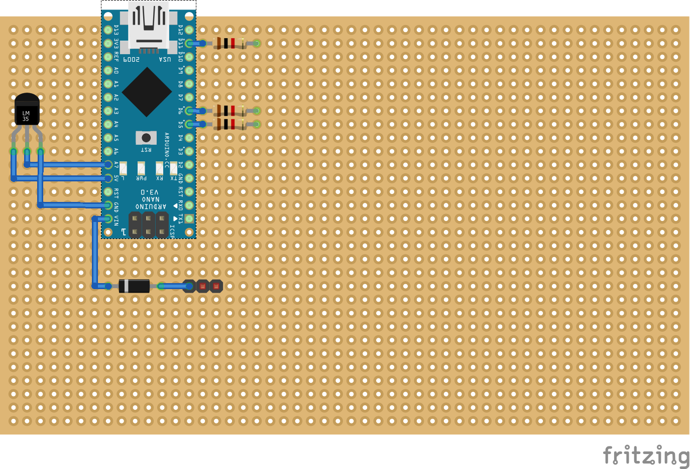

# fan-control

A project for controlling 2, 3, and 4 wire DC fans using an Arduino Nano or a Raspberry Pi. It also integrates into munin monitoring. Funded by the [Free Software Foundation Hungary](https://fsf.hu/). The code is under [GPLv3](https://choosealicense.com/licenses/gpl-3.0/). Schematics, drawings, circuit diagrams, and the documentation is under [CC BY-SA-4.0](https://creativecommons.org/licenses/by-sa/4.0/). If you have an idea about how to improve the project, just file an issue and contribute.

## Pages

* [Bill Of Materials](bom/billofmaterials-nano.md)
* [Datasheet Archive](bom/datasheets.md)
* [KiCad and Fritzing](circuits/)

## Wiki

In **hungarian** and in **english**: [wiki](https://github.com/gajdipajti/fan-control/wiki)

## Fan Control Nano - Schematic

*Note: There are multiple solutions displayed here, only implement the needed ones.*

How to start placing the components

## Fan Control Nano - Code

* [Arduino Nano Code](fan-control-nano/fan-control-nano.ino)

### Serial communication

* 115200 bps
* Main Functions:
  * **pwm?**             - GET all PWM outputs
  * **pwm[A-F]?**        - GET PWM output
  * **pwm[A-F]p**        - SET PWM output to pilot mode
  * **pwm[A-F][0-255]**  - SET PWM output manually
  * **rpm[C,D]?**        - GET RPM output from 4-wire fans
  * **t?**               - GET measured temperature
  * **t[A,D,L,N]?**      - GET measured temperature from selected source
  * **ts?**              - GET temperature source (example Dallas 1-wire)
  * **tsa?**             - GET all available temperature sources
* Calibration Functions:
  * **Ch[L,H,C][A-F]?**        - GET LOW HIGH temperature for a channel
  * **Ch[L,H,C][A-F][0-100]**  - SET LOW HIGH temperature for a channel
  * **p[L,H][A-F]?**           - GET LOW HIGH PWM speed for a channel
  * **p[L,H][A-F][0-255]**     - SET LOW HIGH PWM for a channel
* Misc Func:
  * **hrs?**           - get board uptime [%d:%H:%M:%S]
  * **ver?**           - HW board version number
  * **cbn?**           - CODE build version number
  * **?**              - Ping, Are You There?  + Flash a LED

## Fan Control RPi - Schematic

*Note: There are multiple solutions displayed here, only implement the needed ones.*

*Note: Under testing.*

## Planned updates

* External ADC experiments
* Other board support (RP2040, Attiny85, ...)
* Without machine spirit (no microcontroller)

## References

* [Arduino Language Reference](https://www.arduino.cc/reference/en/)
  * [attachInterrupt()](https://www.arduino.cc/reference/en/language/functions/external-interrupts/attachinterrupt/)
  * [interrupts](http://gammon.com.au/interrupts)
  * [libraries](https://www.arduino.cc/reference/en/libraries/)
* [Arduino Nano](https://docs.arduino.cc/hardware/nano)
* [1-wire protocol](https://docs.arduino.cc/learn/communication/one-wire)
* [Raspberry Pi documentation](https://www.raspberrypi.com/documentation/computers/raspberry-pi.html)
* [Raspberry gpiozero](https://gpiozero.readthedocs.io/en/stable/index.html)
  * [gpiozero - pwmoutput](https://gpiozero.readthedocs.io/en/stable/api_output.html#pwmoutputdevice)
* [Raspberry Pi Zero 2 W Pinout](https://linuxhint.com/raspberry-pi-zero-2w-pinout/)
* [RPI Zero 2W Board Layout](https://www.etechnophiles.com/rpi-zero-2w-board-layout-pinout-specs-price/)

### Free Software used in this project

*Note: I only mention software that can be downloaded and installed.*

* [LibreOffice Writer](https://www.libreoffice.org/) - documentation
* [Visual Studio Code](https://code.visualstudio.com/) - documentation
  * [Markdown All in One](https://marketplace.visualstudio.com/items?itemName=yzhang.markdown-all-in-one)
  * [Markdown PDF](https://marketplace.visualstudio.com/items?itemName=yzane.markdown-pdf)
  * [markdownlint](https://marketplace.visualstudio.com/items?itemName=DavidAnson.vscode-markdownlint)
  * [Remote - SSH](https://marketplace.visualstudio.com/items?itemName=ms-vscode-remote.remote-ssh)
  * [Remote - SSH: Editing Configuration Files](https://marketplace.visualstudio.com/items?itemName=ms-vscode-remote.remote-ssh-edit)
  * [Remote Explorer](https://marketplace.visualstudio.com/items?itemName=ms-vscode.remote-explorer)
  * [Winter is Coming Theme](https://marketplace.visualstudio.com/items?itemName=johnpapa.winteriscoming) - Dark Blue
  * [Cyberpunk Theme](https://marketplace.visualstudio.com/items?itemName=max-SS.cyberpunk) - UMBRA Protocol
  * [Code Spell Checker](https://marketplace.visualstudio.com/items?itemName=streetsidesoftware.code-spell-checker)
  * [isort](https://marketplace.visualstudio.com/items?itemName=ms-python.isort)
  * [Pylance](https://marketplace.visualstudio.com/items?itemName=ms-python.vscode-pylance)
  * [Python](https://marketplace.visualstudio.com/items?itemName=ms-python.python)
* [Arduino IDE](https://www.arduino.cc/en/software) - Arduino code
  * [OneWire](https://www.arduino.cc/reference/en/libraries/onewire/)
  * [DallasTemperature](https://www.arduino.cc/reference/en/libraries/dallastemperature/)
* [KiCad](https://www.kicad.org/download/) - schematics
* [Fritzing](https://github.com/fritzing/fritzing-app/releases/tag/CD-548) - schematics
* [GNU Octave](https://octave.org/) - drawing graphs, advanced calculations
* [Qalculate!](http://qalculate.github.io/) - basic calculation
